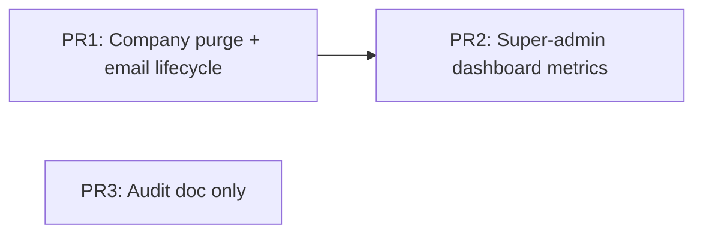

# Company Deletion & Dashboard Data Audit

**Date:** 2026-06-20  
**Scope:** Company hard-delete + user re-invite flow; hardcoded/fake business data on role dashboards  
**Canonical app root:** `web/`

---

## Part 1 — Company Deletion & Re-Invite (IMPLEMENTED)

### Root cause

| Issue | Location | Impact |
|-------|----------|--------|
| Company DELETE was soft-only (`deleted_at`) | `web/app/api/super-admin/companies/[id]/route.ts` | Employees, invites, tokens, and tenant data remained; Prisma `onDelete: Cascade` never fired |
| Employee DELETE was soft-only without email release | `web/app/api/employees/[id]/route.ts`, `web/app/api/super-admin/users/[id]/route.ts` | `Employee.email` is globally `@unique`; terminated rows blocked re-invite |
| Invite/create paths used raw `findUnique({ email })` | invite-user, super-admin users/companies, hr/invites, employees POST | Any tombstoned-but-unreleased email returned 409 |

### Fix summary

| Change | File(s) |
|--------|---------|
| Hard purge via `prisma.company.delete` (cascades) | `web/lib/tenancy/purge-company.ts`, super-admin companies DELETE |
| Release email on deactivation (`released+{id}@released.continuum.invalid`) + revoke tokens/sessions | `web/lib/employee-email-lifecycle.ts`, employee + super-admin user DELETE |
| Central `findEmployeeBlockingEmail()` for invite/create gates | All invite/create routes listed in tests |
| Legacy invite accept clears unreleased deactivated rows | `web/app/api/invite/accept/route.ts` |
| UI copy: permanent delete warning | `web/components/pages/super-admin/companies-view.tsx` |

### Tests

- `web/tests/company-delete-reinvite.test.ts` — lifecycle helpers, route wiring, dashboard filters, UI copy

### Manual test plan

1. Create company A with user `test-reinvite@example.com`
2. Delete company A via super-admin → confirm company row gone, employee row gone
3. Create company B, invite `test-reinvite@example.com` → expect 201, not 409
4. Deactivate user in company B via HR → invite same email to company C → expect success
5. Re-run DELETE on already-purged company id → expect 200 idempotent success

### Remaining / follow-up

- **Legacy data:** Soft-deleted companies/employees created before this fix may still occupy emails until manually purged or migrated
- **Bulk delete API:** Confirm bulk company delete in UI calls the same DELETE endpoint (single-id per request)
- **Production migration:** Optional one-off script to hard-delete companies where `deleted_at IS NOT NULL` and release emails on terminated employees still holding real addresses

---

## Part 2 — Hardcoded / Fake Dashboard Data Audit

Per AGENTS.md: production dashboards must not show mock business data. Form placeholders and onboarding copy are excluded.

### super_admin

| File | Finding | Severity | Backing API / fix |
|------|---------|----------|-------------------|
| `web/app/super-admin/dashboard/page.tsx` | **Fixed:** counts included soft-deleted companies/employees | High (inflated metrics) | `activeCompanyWhere` / `activeEmployeeWhere` from `web/lib/tenancy/active-tenant-query.ts` |
| `web/components/pages/super-admin/dashboard-view.tsx` | Same count issue **fixed**; file appears **unused** (no imports) | Medium | Consider removing duplicate or wiring to route |
| `web/components/pages/super-admin/dashboard-view.tsx` | `pendingLeaves` counts **all tenants** globally (live, not fake) | Low (accuracy) | Scope to active companies or add label "Platform-wide" |
| `web/components/pages/super-admin/dashboard-view.tsx` | `documents` count is platform-wide unscoped | Low | Same as above |
| Getting Started steps | Static onboarding copy | OK | Not business data |

**Implementation plan (super_admin — done for highest impact):**

- Filter company/employee counts with `activeCompanyWhere` / `activeEmployeeWhere`
- **Test:** extend `company-delete-reinvite.test.ts` (source contract) + manual: delete company, refresh dashboard, count drops

### admin

| File | Finding | Severity | Notes |
|------|---------|----------|-------|
| `web/components/pages/admin/dashboard-view.tsx` | All metrics from Prisma (`employee.count`, `userInvite`, `leaveRequest`, `auditLog`) | None | Live data, tenant-scoped |
| Console `console.info` on load | Debug logging only | OK | Not UI data |

**No fake data fixes required.**

### hr

| File | Finding | Severity | Notes |
|------|---------|----------|-------|
| `web/components/pages/hr/dashboard-view.tsx` | Prisma-backed headcount, invites, leave SLA, documents | None | Live data |
| `web/components/pages/hr/bulk-import-view.tsx` | Sample CSV template rows | OK | Form/template, not runtime dashboard |

**No fake data fixes required.**

### manager

| File | Finding | Severity | Notes |
|------|---------|----------|-------|
| `web/components/pages/manager/dashboard-view.tsx` | Team members, approvals, SLA from Prisma | None | Live data |
| Attendance % bars use `pctClass()` on real counts | OK | Visual only |

**No fake data fixes required.**

### employee

| File | Finding | Severity | Notes |
|------|---------|----------|-------|
| `web/components/pages/employee/dashboard-view.tsx` | Attendance, leave requests from Prisma | None | Live data |
| `LeaveBalanceCards`, `UpcomingHolidays` | Client components calling APIs | None | Live data |

**No fake data fixes required.**

### Cross-role notes

- No `mockData` / hardcoded business arrays found in the five canonical `dashboard-view.tsx` files
- Prior concern about fake arrays was **not confirmed** in current codebase
- Main authenticity gap was **super-admin platform counts including deleted tenants** — fixed

---

## Part 3 — PR Split Plan (approval required before execution)

Per split-to-prs skill — **do not commit/push until user approves slices.**



| PR | Title | Files (indicative) | Base | Depends on |
|----|-------|-------------------|------|------------|
| **PR1** | fix(tenancy): hard-delete companies and release emails on deactivation | `lib/employee-email-lifecycle.ts`, `lib/tenancy/purge-company.ts`, `lib/tenancy/active-tenant-query.ts`, API routes (companies, employees, invites), `companies-view.tsx`, `tests/company-delete-reinvite.test.ts` | `main` | — |
| **PR2** | fix(super-admin): scope dashboard counts to active tenants | `app/super-admin/dashboard/page.tsx`, `components/pages/super-admin/dashboard-view.tsx` | `main` | PR1 (shared `active-tenant-query`) or include query helper in PR1 |
| **PR3** | docs: company delete and dashboard audit | `docs/plan/company-delete-and-dashboard-data-audit.md` | `main` | — |

**Recommendation:** Merge PR1 + PR2 together if reviewer prefers one tenancy PR (~15 files, cohesive). Keep audit doc as separate docs-only PR or fold into PR1.

**Out of scope for this split:** Email transport (SendGrid/Resend), Clarity analytics, unrelated dirty working tree files.

---

## Part 4 — Blockers

| Blocker | Status |
|---------|--------|
| Legacy soft-deleted rows in production DB | Needs optional migration script or manual purge |
| Duplicate unused `dashboard-view.tsx` for super-admin | Low priority cleanup |
| Full E2E against production DB | Requires seeded environment; structural tests pass locally |

---

## Verification commands

```bash
cd web
npm test -- tests/company-delete-reinvite.test.ts
```
