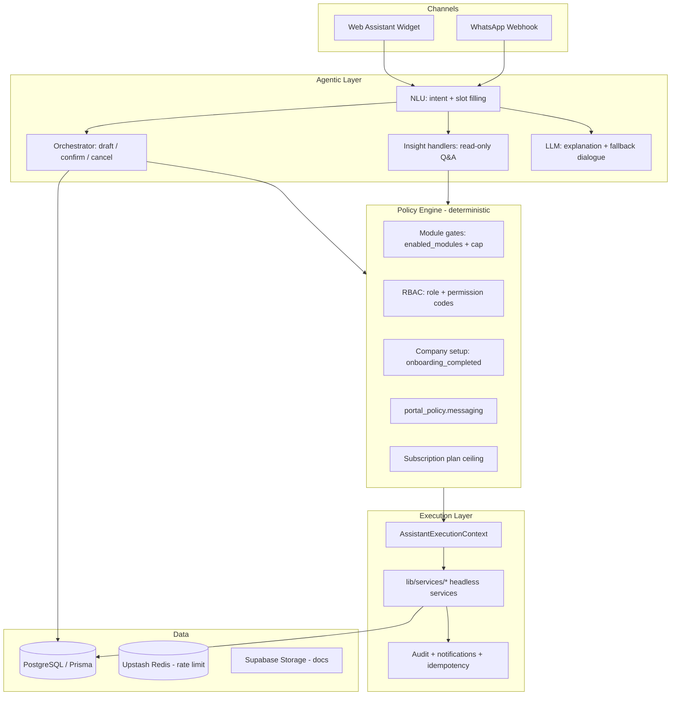
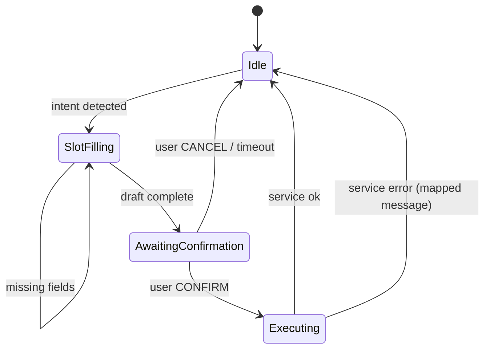

# Zero UI Agentic Architecture

**Status:** Canonical architecture for Continuum Zero UI (web assistant + WhatsApp).
**Companion:** `enterprise_real_journey_scenarios.md`, `web/docs/ZERO_UI_V1_ACTIONS.md`, `GLOBAL_WEB_REMEDIATION_IMPLEMENTATION_PLAN.md`.

---

## 1) Core principle: not hardcoded per user

Zero UI must **not** be a fixed checklist baked per employee or per company UI.

It must be a **policy-constrained agentic system** where:

| Layer | What it does | Must NOT do |
|-------|----------------|-------------|
| **Capability registry** | Declares what actions *can* exist (A1–A10, insights, admin copilots) | Store per-user button lists |
| **Runtime policy engine** | Filters capabilities by tenant module state, RBAC, company setup, channel policy | Let LLM decide permissions |
| **NLU / dialogue layer** | Parses natural language, fills slots, explains outcomes | Execute mutations directly |
| **Headless services** | Single write path shared by web API, assistant, WhatsApp | Duplicate business rules per channel |
| **Orchestrator** | Draft → confirm → execute state machine | Skip confirmation on writes |

**Correct mental model:**

> The agent is globally the same product brain.
> Each company sees a **different effective tool surface** because modules, roles, permissions, and policies are configurable — not because we hardcode different agents.

**Wrong mental model:**

> Hardcode “Employee X can do tasks [A,B,C]” or “Company Y gets WhatsApp phrases [1,2,3].”

---

## 2) Hybrid agentic design (how it should work)



### 2.1 What is “agentic” here?

- **Agentic:** understands varied phrasing, multi-turn dialogue, summarizes policy, suggests next steps, routes to the right capability.
- **Not unbounded agentic:** cannot invent permissions, bypass module gates, or write to DB without passing services + confirm step.

This is **constrained tool-use agentics**, not open-ended autonomous HR.

---

## 3) Tech stack

| Concern | Technology | Location |
|---------|------------|----------|
| Web app | Next.js 15 (App Router), React 19 | `web/` |
| API | Next.js Route Handlers | `web/app/api/**` |
| ORM / DB | Prisma 6, PostgreSQL | `web/prisma/` |
| Auth | Custom JWT (access + refresh) | `web/lib/auth-service.ts`, `jwt-service.ts` |
| RBAC | Permission catalog + company overrides | `web/lib/rbac.ts` |
| Module catalog | CF-001..CF-015 slugs | `web/lib/core-functions/catalog.ts` |
| Tenant module state | `CompanySettings.hr_alerts` JSON | `resolve.ts`, `assert-module.ts` |
| Assistant brain | Continuum Guide | `web/lib/continuum-assistant/` |
| Headless services | Zero UI execution | `web/lib/services/` |
| LLM | OpenAI `gpt-4o-mini` (optional) | `respond.ts` |
| Constraint / AI leave | Python engine + TS decision layer | `backend/`, `lib/ai-engine/` |
| Rate limiting | In-memory + Upstash Redis | `lib/api-rate-limit.ts` |
| Messaging | Meta WhatsApp Business API | `web/app/api/webhooks/whatsapp/route.ts` |
| Payments | Razorpay | `lib/payment-service.ts` |
| Observability | Sentry, Winston, prom-client | enterprise libs |

---

## 4) Configuration surfaces (why behavior differs per company)

All assistant capabilities are filtered through these **tenant-configurable** inputs:

### 4.1 Module entitlement (`CompanySettings.hr_alerts`)

```json
{
  "super_admin_cap": ["leave", "attendance", "payroll", "..."],
  "enabled_modules": ["leave", "attendance", "documents"],
  "module_features": { "leave": { "ai_auto_approve": true } },
  "onboarding_draft": { ... },
  "role_quota_map": { "employee": { "CL": 12 } }
}
```

| Field | Who sets | Effect on Zero UI |
|-------|----------|-------------------|
| `super_admin_cap` | Super-admin | Maximum modules tenant may enable |
| `enabled_modules` | Super-admin / admin | Effective tool catalog |
| `module_features` | Admin | Sub-features (AI leave, etc.) |
| `role_quota_map` | Admin onboarding | Balance answers, validation |
| `onboarding_draft` | Onboarding wizard | Setup copilot context |

### 4.2 Portal / messaging policy (`CompanySettings.portal_policy`)

| Field | Default | Effect |
|-------|---------|--------|
| `require_employee_phone` | false | Blocks channel link without phone |
| `whatsapp_opt_in_required` | true | Opt-in before WhatsApp actions |
| `chat_retention_days` | 90 | Message/draft retention |

### 4.3 RBAC (`RolePermission` + defaults)

Permissions are **not** hardcoded per user. They are:

1. Default bundles per role (`employee` → `leave.apply_own`, etc.)
2. Company overrides in `RolePermission`
3. **Must be intersected** with `enabled_modules` at runtime (`filterPermissionsByModules` implemented in `web/lib/rbac.ts` and covered by `web/tests/rbac.test.ts`)

### 4.4 Plan ceiling (`Subscription` + `PLAN_MODULE_LIMITS`)

Billing plan clamps module cap on upgrade/downgrade.

### 4.5 Company lifecycle

| Flag | Gate |
|------|------|
| `company.onboarding_completed` | Most employee mutations |
| `employee.status` | active / probation only |
| `employee.must_change_password` | May restrict flows |
| Notice period | Blocks new leave apply |

---

## 5) Capability registry (global actions, not per-user tasks)

Canonical v1 catalog: `web/docs/ZERO_UI_V1_ACTIONS.md`

| ID | Capability | Type | Service | Permission(s) | Module |
|----|------------|------|---------|---------------|--------|
| A1 | Request leave | **Write** | `submitLeaveService` | `leave.apply_own` | leave |
| A2 | Leave balance | Read | `getLeaveBalancesService` | `leave.apply_own` | leave |
| A3 | My leaves | Read | `listOwnLeavesService` | `leave.apply_own` | leave |
| A4 | Cancel leave | **Write** | `cancelLeaveService` | `leave.apply_own` | leave |
| A5 | Pending approvals | Read | `listPendingApprovalsService` | `leave.approve_team` / `approve_any` | leave |
| A6 | Approve/reject leave | **Write** | `approveLeaveService` / `rejectLeaveService` | approve permissions | leave |
| A7 | Clock in/out | **Write** | `clockAttendanceService` | `attendance.mark_own` | attendance |
| A8 | Today attendance | Read | `getTodayAttendanceService` | `attendance.mark_own` | attendance |
| A9 | Latest payslip | Read | `getLatestPayslipService` | `payroll.view_own` | payroll |
| A10 | Leave insights | Read | insight handlers | scope-based | leave |

**Insight extensions (read-only copilots):**

- Constraint explain, suggest dates, approval queue summary
- Policy / approval chain explainer
- Payslip line explain
- Setup status, payroll preflight, bulk import guide
- Invite help, employee first-day, onboarding drafts

New modules (performance, expenses, etc.) extend the registry — they do **not** require a new agent per tenant.

---

## 6) Runtime resolution algorithm

For every inbound message (web or WhatsApp):

```
1. RESOLVE_IDENTITY
   - Web: JWT session → buildContextFromSession
   - WhatsApp: ChannelIdentityLink → buildContextFromLink

1a. WHATSAPP_TENANT_RESOLUTION
   - Resolve tenant first from Meta metadata.phone_number_id
   - Then find ChannelIdentityLink inside that company only
   - Same user phone may belong to multiple companies without cross-tenant routing

2. LOAD_TENANT_STATE
   - enabled_modules, module_cap, module_features
   - company.onboarding_completed
   - portal_policy.messaging

3. LOAD_AUTHZ
   - primary_role, secondary_roles
   - permission codes (filtered by enabled modules)

4. CLASSIFY_INTENT (NLU)
   - rule patterns first (deterministic)
   - optional LLM for paraphrase / explanation only

5. MAP_INTENT → CAPABILITY
   - e.g. "book sick leave tomorrow" → A1

6. POLICY_CHECK (fail closed)
   IF module disabled → MODULE_DISABLED message
   IF permission missing → FORBIDDEN message
   IF company setup incomplete → COMPANY_SETUP_INCOMPLETE
   IF notice period → NOTICE_PERIOD (leave apply)

7. ROUTE
   - READ capability → service or insight handler → formatted reply
   - WRITE capability → start/update draft → await_confirmation

8. ON CONFIRM
   - re-run policy check (stale state guard)
   - call headless service with idempotency key
   - audit log + notifications
   - clear draft

9. REPLY
   - deterministic error mapping (never leak other employee PII)
   - deep link to portal page for complex follow-up
```

---

## 7) Orchestration state machine (writes)

All mutations use the same state machine:



| State | Stored in | TTL |
|-------|-----------|-----|
| Web (current) | Client `actionDraft` in widget | 15 min |
| Web + WA (target) | `AssistantConversation.draft_json` | 15 min |

Draft kinds today: `request_leave`, `approve_leave`, `reject_leave`.

---

## 8) Database model (Zero UI–relevant)

| Model | Purpose |
|-------|---------|
| `Employee` | Identity, role, manager, status |
| `Company` | Tenant, `onboarding_completed` |
| `CompanySettings` | `hr_alerts`, `portal_policy`, hierarchy |
| `LeaveRequest` | Leave workflow + AI fields |
| `LeaveBalance` | Entitlement / used / pending |
| `LeaveType` | Per-company types + default_quota |
| `ApprovalHierarchy` | L1–L4 + HR partner chain |
| `ChannelIdentityLink` | WhatsApp ↔ employee binding |
| `ChannelVerificationChallenge` | OTP for phone link |
| `AssistantConversation` | Server draft + channel session |
| `AssistantMessageRecord` | Chat history (retention policy) |
| `RefreshToken` | Session lifecycle |
| `AuditLog` | Cross-channel audit trail |
| `RolePermission` | Company RBAC overrides |
| `Subscription` / `Payment` | Plan entitlements |

---

## 9) Backend workflow (execution path)

```
Channel message
  → POST /api/ai/assistant (web)
  → POST /api/webhooks/whatsapp

respondAssistantMessage()
  → team-data refusal (privacy)
  → personal snapshot (A2-like)
  → processAssistantActions() [orchestrator]
  → processInsightIntents() [read-only]
  → knowledge rules + OpenAI fallback

On confirm:
  request-leave.ts / approve-leave.ts
    → assistantContextToExecutionContext()
    → submitLeaveService() / approveLeaveService()
      → guardCompanySetup()
      → guardModule(orgId, 'leave')
      → guardPermission(...)
      → business logic + audit
```

**Invariant:** Assistant never calls `fetch('/api/...')` with forwarded cookies for mutations. It calls `lib/services/*` directly.

---

## 10) Formulae and algorithms

### 10.1 Leave day calculation

```
IF is_half_day:
  total_days = 0.5
ELSE:
  total_days = business_days_between(start_date, end_date)
  excluding company holidays (LeaveType / holiday calendar)
```

### 10.2 Balance check (submit)

```
remaining = annual_entitlement + carried_forward - used_days - pending_days
IF total_days > remaining:
  REJECT INSUFFICIENT_BALANCE
```

### 10.3 Approver resolution (`resolveLeaveApprovers`)

Priority order:

1. `ApprovalHierarchy` levels L1 → L4 → HR partner
2. `employee.manager_id`
3. `employee.invited_by_id`
4. Fallback: first active hr / director / admin in company

### 10.4 Sequential approval (`sequential-approval.ts`)

Multi-level chain: each level must act before next; final approval updates balance.

### 10.5 Constraint engine

```
IF constraint engine reachable:
  POST policy rules → pass | warnings | fail
ELSE:
  degrade gracefully (circuit breaker)
```

Optional AI layer (`ai-engine/decision-engine`):

```
decision ∈ { auto_approve, manual_review, escalate }
confidence, risk_score, reasoning[], flags[]
```

May auto-approve when company `module_features` / `hr_alerts.ai` allows.

### 10.6 Module enablement formula

```
effective_modules =
  enabled_modules
  ∩ super_admin_cap
  ∩ PLAN_MODULE_LIMITS[subscription.plan]
  ∪ MANDATORY_SLUGS

capability_available(cap) :=
  cap.module ∈ effective_modules
  AND user.hasPermission(cap.permissions)
  AND company.passesSetupGates(cap)
```

### 10.7 Manager data scope (API + assistant)

```
IF role ∈ {manager, team_lead} AND NOT employee.view_all:
  visible_employees = { self } ∪ { reports where manager_id = self.id }
ELSE IF employee.view_all:
  visible_employees = all in org
```

---

## 11) Scenario matrix (all enterprise modes)

### 11.1 Module entitlement scenarios

| Scenario | Enabled modules | User sees in nav | Assistant effective tools | Blocked example |
|----------|-----------------|------------------|---------------------------|-----------------|
| **S1 Leave-only** | leave + mandatory | Leave, profile, essentials | A1–A6, A10 (leave) | "my payslip" → MODULE_DISABLED |
| **S2 Leave + payroll** | leave, payroll, mandatory | + payslips | + A9 payslip read | performance reviews blocked |
| **S3 Leave + attendance** | leave, attendance | + attendance | + A7, A8 | payroll blocked |
| **S4 All modules** | full cap | Full portal nav | Full v1 catalog + insights | none (still RBAC scoped) |
| **S5 Cap > enabled** | cap=10, enabled=3 | Only 3 module groups | Tools for 3 only | Admin must enable + setup before use |
| **S6 Mid-session disable** | payroll toggled off | Nav hides payslips | A9 immediately blocked | Fail safe, no stale allow |

### 11.2 Role / hierarchy scenarios

| Scenario | Roles present | Approval path | Manager visibility |
|----------|---------------|---------------|-------------------|
| **R1 Admin + HR + Employee** | No manager | HR/admin fallback chain | N/A |
| **R2 Full hierarchy** | + manager | Manager → escalation → HR | Team-scoped default |
| **R3 Super-admin tenant** | Platform governed | Normal tenant rules inside company | Super-admin not in employee flows |

### 11.3 Channel scenarios

| Scenario | Channel | Identity | Draft store | Status |
|----------|---------|----------|-------------|--------|
| **C1 Web assistant** | web | JWT | Client draft (today) | Live |
| **C2 WhatsApp** | whatsapp | ChannelIdentityLink | AssistantConversation | Enabled for configured tenants |
| **C3 Mixed continuity** | web → WA | Same employee | Server draft required | Target |

### 11.4 Lifecycle scenarios

| Stage | Zero UI behavior |
|-------|------------------|
| Provisioning | No employee access; super-admin only |
| Onboarding incomplete | Read-only guidance; mutations blocked with setup message |
| Go-live (leave) | A1/A6 fully operational |
| Expansion | New module → new tools appear after setup hub readiness |
| Downgrade | Data retained; capabilities removed at policy layer |

### 11.5 Security / failure scenarios

| Scenario | Expected behavior |
|----------|-------------------|
| Expired token | Re-auth prompt; no mutation |
| Revoked channel link | WhatsApp identity rejected |
| Rate limit exceeded | 429 mapped to user message |
| LLM unavailable | Rule-based fallback; no mutation impact |
| DB down | INTERNAL_ERROR; fail closed on writes |

---

## 12) Tools vs actions vs tasks (terminology)

| Term | Meaning in Continuum |
|------|----------------------|
| **Task** | User-facing outcome ("apply for sick leave") — *not* a code artifact |
| **Action** | Catalog entry A1–A10 with permissions + service binding |
| **Tool** | Callable service function (`submitLeaveService`) |
| **Intent** | NLU classification of user message |
| **Draft** | In-progress write payload awaiting confirm |
| **Insight** | Read-only handler (no confirm) |

---

## 13) Error contract (deterministic user messaging)

| Code | User message pattern |
|------|----------------------|
| `MODULE_DISABLED` | "{Module} is not enabled for your company." |
| `FORBIDDEN` | "You don't have permission to …" |
| `INSUFFICIENT_BALANCE` | "Not enough {leaveType} balance." |
| `COMPANY_SETUP_INCOMPLETE` | "Complete company setup first." |
| `NOTICE_PERIOD` | "Leave cannot be applied during notice period." |
| `NOT_FOUND` | "No matching record found." |
| `OVERLAP_CONFLICT` | "You already have leave for these dates." |

Never expose other employees' PII in error text.

---

## 14) What Zero UI should never do

- Replace full admin configuration UIs
- Execute writes without confirm step
- Trust LLM output for authorization
- Store per-user hardcoded task lists
- Bypass module middleware / API gates
- Return raw payslip PDF bytes in chat (link only)
- Answer cross-employee sensitive queries without permission

---

## 15) Implementation status (honest)

| Area | Status |
|------|--------|
| Headless services (leave, attendance, payslip) | Implemented |
| Web assistant leave write (A1, A6) | Live |
| Insight handlers (A10 extensions) | Live |
| Personal balance snapshot (A2) | Partial (not full service path) |
| A3, A4, A7–A9 dedicated handlers | Services exist; orchestrator incomplete |
| `filterPermissionsByModules` | Implemented in `web/lib/rbac.ts`; covered by `web/tests/rbac.test.ts` |
| Server-side `AssistantConversation` store | Web and WhatsApp persist drafts/history server-side |
| WhatsApp webhook + outbound | Implemented; enabled for configured tenants |
| Permission-filtered dynamic tool registration | Target architecture (this doc) |

---

## 16) Target: dynamic capability registration (not hardcoding)

```typescript
// Conceptual — capability registry at startup
const CAPABILITIES = registerFromCatalog(ZERO_UI_V1_ACTIONS);

// Per request — filtered tool surface
function resolveEffectiveCapabilities(ctx: AssistantContext): Capability[] {
  return CAPABILITIES.filter((cap) =>
    isModuleEnabled(ctx.enabledModules, cap.module) &&
    hasPermission(ctx.permissions, cap.permissions) &&
    passesChannelPolicy(ctx, cap) &&
    passesSetupGate(ctx.companyId, cap)
  );
}

// Orchestrator only exposes resolveEffectiveCapabilities(ctx)
// LLM may explain and route language → capability id
// LLM may NOT add capabilities outside this set
```

---

## 17) Release gates (Zero UI)

Before claiming Zero UI production-ready:

- [x] G1-G6 pre-flight sign-off (`web/docs/ZERO_UI_V1_ACTIONS.md`)
- [ ] All v1 write actions: confirm + audit + idempotency
- [x] Module gating consistent for the tested enterprise matrix: nav + middleware + API + assistant
- [x] Server-side draft for WhatsApp and web assistant
- [x] `filterPermissionsByModules` implemented
- [x] Scenario matrix S1–S6, R1–R2, C1–C3 automated tests
- [x] No mutation without `AssistantExecutionContext` on current v1 write execution paths

Proof added on 2026-06-28:

```powershell
cd web
npm test -- --test-reporter=spec tests/enterprise-scenario-matrix.test.ts tests/continuum-assistant-v1-headless.test.ts tests/module-api-gating.test.ts tests/rbac.test.ts
npx tsc --noEmit --pretty false --incremental false
npm run build
```

---

## 18) Related files

| Path | Role |
|------|------|
| `web/lib/continuum-assistant/respond.ts` | Main routing |
| `web/lib/continuum-assistant/actions/orchestrator.ts` | Write orchestration |
| `web/lib/continuum-assistant/insights/handlers.ts` | Read-only insights |
| `web/lib/services/*` | Headless execution |
| `web/lib/core-functions/catalog.ts` | Module slugs |
| `web/lib/rbac.ts` | Permissions |
| `web/lib/channel/context-from-link.ts` | WhatsApp identity |
| `web/docs/ZERO_UI_V1_ACTIONS.md` | Frozen v1 catalog |
| `docs/enterprise_real_journey_scenarios.md` | Enterprise journey contract |

---

## 19) One-paragraph product answer

Zero UI is a **single global agent** whose **effective abilities are computed per request** from module entitlements, RBAC, company setup, plan limits, and channel policy. Natural language makes it feel agentic; deterministic policy and headless services make it enterprise-safe. The website remains the full control plane; Zero UI is the high-frequency execution layer for employees and managers — especially leave today, expanding module-by-module without rewriting the agent per customer.
